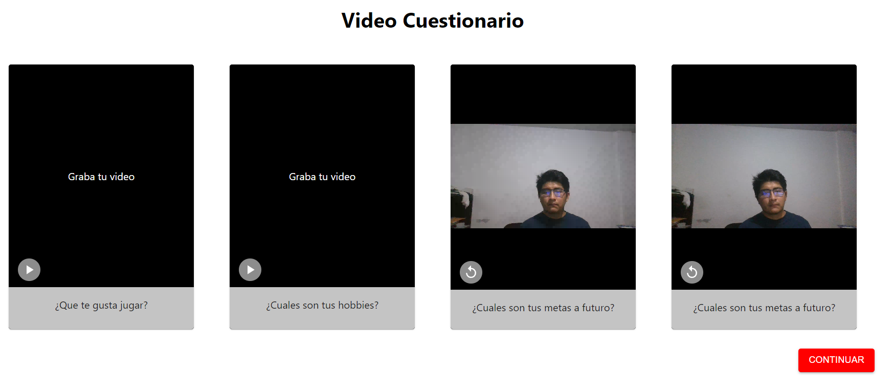
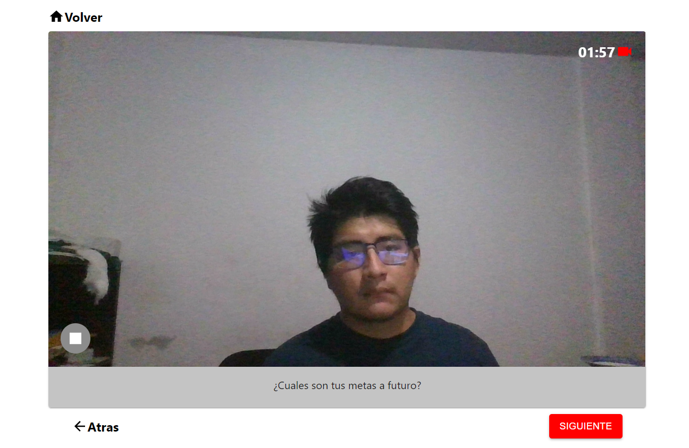

# Reto Video Cuestionario
Este reto consiste en crear la parte fronted la cual permite cualquier cantidad de preguntas, para que el usuario pueda responderlas en modo de video.
Presentamos un pequeño avance creado en React.

    

Como se puede apreciar esta demo, podemos previsualizar los videos ya creados, además que se puede extender para más preguntas.  

  

La segunda parte cumple ciertas condiciones como: el botón siguiente solo nos puede rederigir a la siguiente pregunta sin contestar, que el boton de la parte izquierda inferior, es el controlador del video, y como máximo la respuesta puede durar 2 minutos, mostrando el tiempo que resta en tiempo real. Esto fue realizado en React

  

